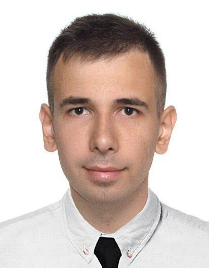

# CV

# Ambrosov Dmytro



## Junior Frontend Developer

======================================================


### Info
+
    -tel: +380968118711
    -mail: eambrosov1@gmail.com
    -Telegram: @madrid_d
    -[LinkdIn][https://www.linkedin.com/in/dmytro-ambrosov-0b0520140/]


My goal to be Front-end Developer, I really like to sit at a computer and solve tasks.
I try to learn something new and always be in trend in terms of information.


=======================================================


*
    -HTML
    -CSS
    -Javascript
    -SASS
    -Git
    -VS Code
    -Figma


=======================================================


### Example Code from Codewars

```
function even_or_odd(number) {
  if (number % 2 == 0 ){
    return 'Even'
  }else {
    return 'Odd';
  }
}
```

======================================================


### Experience

There is a good project where not a small amount of knowledge is shown [Web-studio][https://github.com/Ambr0s0v/web-studio"]


======================================================


### Education

 *
    -Kharkiv National University of Radio Electronics (2009-2015)
    -HTML academy
    -GoIT Course


======================================================


### English

A2 - I continue to study English, as it is relevant and opens up new frontiers


